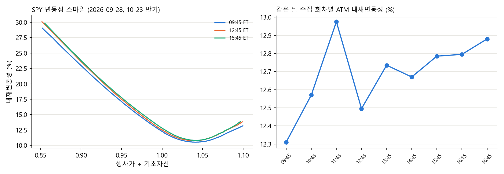

# 미국 옵션 체인 수집

SPY, TSLA, AAPL, NVDA, IBIT의 옵션 체인 전체(모든 만기, 모든 행사가)를 하루 10번 정해진 시각에 수집합니다. 1시간 간격 델타헤지 손익을 감마와 세타로 나눠 보기 위한 데이터입니다.



## 수집 내용

| 항목 | 내용 |
|---|---|
| 종목 | SPY, TSLA, AAPL, NVDA, IBIT |
| 범위 | 모든 만기, 모든 행사가 (SPY는 1회 약 13,000행) |
| 시각 (뉴욕) | 09:45부터 15:45까지 매시, 16:15, 16:45, 장 마감 후. 하루 10회 |
| 필드 | 매수·매도 호가와 잔량, 내재변동성, 델타·감마·베가·세타·로, 거래량, 미결제약정, 기초자산 가격, 수집 시각 |
| 출처 | CBOE 지연 시세 |
| 기간 | 2026-08-28부터 |

## 구조

```
cron-job.org  →  GitHub Actions (이 저장소)  →  CBOE 지연 시세
                          │
                          └→  비공개 데이터 저장소에 저장 (회차당 커밋 1개, gzip CSV)
```

- GitHub Actions 예약 실행은 수십 분씩 늦을 때가 있어서, 외부 크론이 정시 전에 작업을 시작하고 스크립트가 목표 시각까지 기다렸다가 받습니다. 시각은 뉴욕 시간으로 계산해서 서머타임이 자동으로 반영됩니다.
- GitHub 자체 예약도 백업으로 걸어 두었습니다. 같은 시간대 작업이 겹치면 하나는 대기하고, 이미 지난 회차는 건너뜁니다.
- 이 저장소에는 코드만 두고, 데이터는 비공개 저장소에 GitHub API로 저장합니다. 토큰은 데이터 저장소 쓰기 권한만 있는 것을 Actions Secret으로 넣었습니다.
- 파일은 gzip으로 압축해서 저장합니다(약 1/5 크기).

## 실행

```bash
pip install -r requirements.txt
python collect_cboe.py eod      # 지금 1회 수집. DATA_TOKEN이 없으면 data/에 저장
```

```python
import pandas as pd
df = pd.read_csv("data/SPY/2026-09-28/SPY_2026-09-28_1045.csv.gz", parse_dates=["expiry"])
```

Actions에서 돌리려면 Secret `DATA_TOKEN`(데이터 저장소 Contents 쓰기 권한)과 Variable `DATA_REPO`(예: `owner/data`)가 필요합니다.
